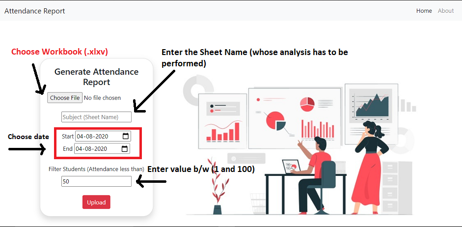
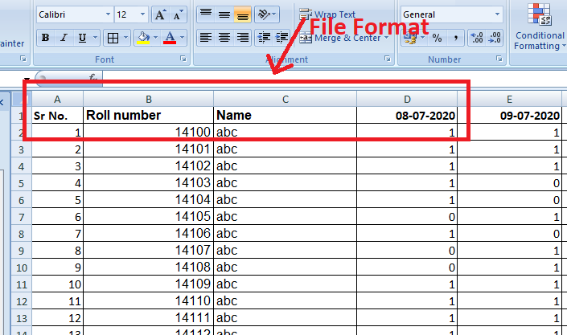
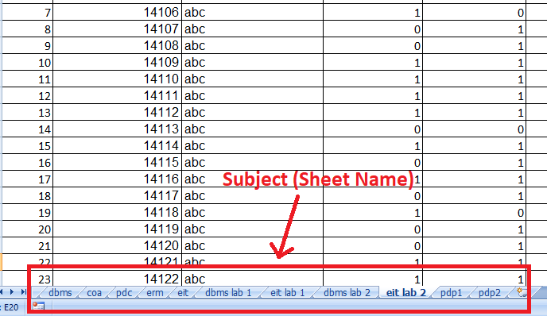
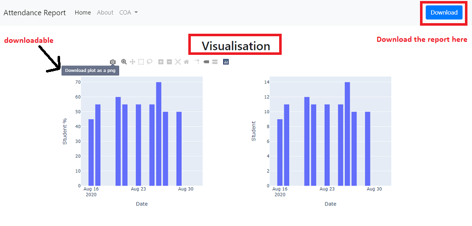

# Analysis on Attendance Report
Upload .xlsx workbook that contains multiple attendance sheets. Then choose your filters and get the report.

Access the link here - http://att-analysis-report.herokuapp.com/

# Brief Description

The purpose of developing this software is to generate the report automatically.
Student's attendance analysis gives the visual insights and downloadable file that can be shared.

# File Format

The file format should be in this format :
1. Serial Number
2. RollNumber
3. Name
4. Then student's record with date attribute.

# Sheet tabs
For subject analysis - You have to enter the same name which you have provided in your sheet name in xlsx workbook.
like - For EIT Lab group 1 analysis. you have to enter eit lab 1 as written in screenshot.

# Visualisation

1. Date wise analysis of students in the particular lectures.
2. Total number of students that are presented in the particular time span.
3. Students report.
4. Students can be filtered on the basis of the percentage of their attendance.
5. The option of download is also available.
6. Visualization for better understanding.

